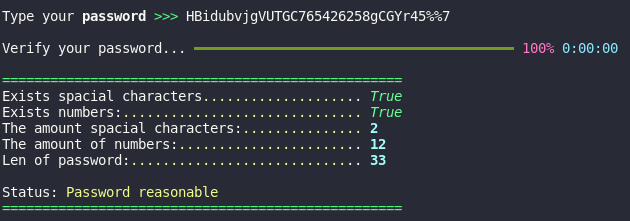
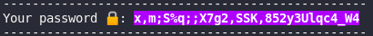

# Analyze Passwords :lock:

### ATTENTION !!, this program was created for the linux platform, and it may have problems with the windows platform

## Why Analyze your passwords?
Because, strong passwords make it harder for hackers.

### How to run?
Update or installer python3.10 and, install with pip the requerents.txt
  
~~~001
    pip install -r requerents.txt
~~~
~~~002
    pip3.10 install -r requerents.txt
~~~

___

#### Analyze your passwords:

#### Create strong passwrod:

